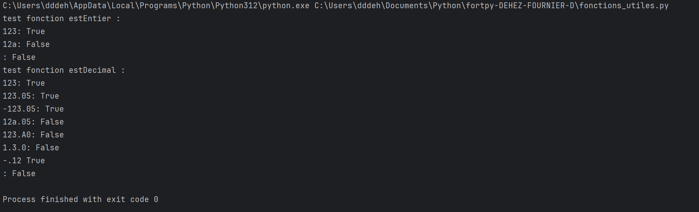
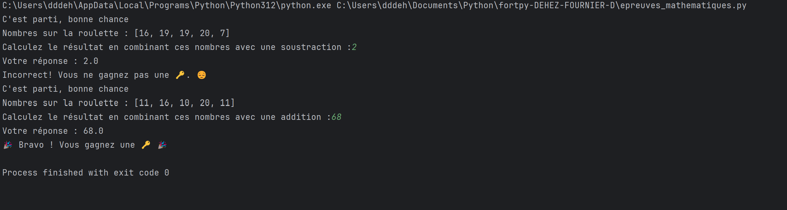

# Présentation Général : 
- Nom du projet : **fortpy-DEHEZ-FOURNIER-D** 
- Réalisé par **DEHEZ Delphine** et **Aurélia FOURNIER**, étudiantes P1 à EFREI Paris , toute les deux développeurs 
- Notre projet est un jeu simulant le célèbre jeu télévisé 'Fort Boyard', mini-jeu réalisé avec une interface homme-machine
- Le joueur joue contre le 'maitre du jeu' (l'ordinateur) avec un ensemble de mini jeu alliant mathématique,logique,hasard,enigmes utilisant des fichiers Json
- Pour le réaliser nous avons utilisé le language python avec l'utilisation de PyCharm, les bibliotèques ramdom, Json et winsoud  
- Vous avez besoin de python 3.9+ 
Pour cloner le dépot Git : ```git clone https://github.com/delphine-dhz/fortpy-DEHEZ-FOURNIER-D ```
--Mettre dans le répertoire DATA les 2 fichiers json : **enigmesPF.json** et **indicesSalle.json**

# Documentation Technique : 
### L'algorithme que nous avons créé se déroule comme ceci : 
- Composition des équipes : Nombres de joueurs, leurs noms et professions
- Choix de L'épeuve : 
Choix de l'épreuve parmi 4 types : Mathématiques, logique , Hasard, Enigmes père Fouras 
- Choix du joueur qui fera l'épreuve
- L'algorithme choisi l'épreuve aléatoirement pour Mathématiques (parmi les jeux : nombres premiers, équation linéaire et roulette mathématique) , Hasard ( parmi les jeux : bonneteau et lancé de dés) , Enigmes père Fouras( enigme tiré aléatoirement) , pour l'épreuve de logique cest le célèbre jeu de la bataille Naval
- L'épreuve s'éxécute : 
si le joueur gagne il remporte une clef, si le maitre gagne le joueur ne remporte pas de clef 
Le joueur continue de faire des épreuves tant qu'il n'a pas 3 clefs 
lorsqu'il a 3 clefs l'épreuve finale se lance : cette épreuve consiste à résoudre une enigme à l'aide d'indices 
Les trois premiers indices sont affichés pour aider le joueur à deviner le mot-code et il dispose de trois essais au total
Après chaque mauvaise réponse, le joueur reçoit un nouvel indice et le nombre d'essais restants est indiqué.
Si le joueur échoue après trois essais, le mot-code correct est révélé.
Si le joueur a réusi à trouver l'énigme il entre dans la salle du trésor et gagne le jeu, s'il ne trouve pas l'énigme il perd le jeu 
        
### liste des fonctions :
nous avons d'abord créé les fichiers suivants avec comme fonctions :  
#### data
- enigmesPF.json : contenant des énigmes à résoudrent dans le fichier enigme_pere_fouras.py
- indicesSalle.json : contenant des indices pour ouvrir la salle du trésor dans le fichier enigme_pere_fouras.py
#### enigme_pere_fouras.py 
```
enigme_pere_fouras() : épreuve du père Fouras,le joueur doit résoudre une énigme posée par le Père Fouras 
charger_enigme(fichier) : prend en paramètre un fichier et le charge sous la forme d'une variable json en mémoire 
```
#### epreuve_finale.py 
```
salle_de_tresor() : épreuve finale, la salle du trésor représente la dernière étape du jeu où l'équipe après avoir collectée les 3 clés, doit déchiffrer une énigme nécessaire pour ouvrir la porte et accéder au trésor 
```
#### epreuves_hasard.py
```
bonneteau() : épreuve du bonneteau,le joueur doit deviner sous quel bonneteau (A, B ou C) se cache la clé (clef cachée aléatoirement) et il dispose de deux essais pour le trouver
jeu_lance_des() :épreuve lancé de dés,le joueur et le maître du jeu lancent chacun deux dés. Le premier à obtenir un 6 remporte la partie, avec un maximum de trois essais
epreuve_hasard() : Choix de l'épreuve au hasard 
```
#### epreuves_logiques.py
```
jeu_bataille_navale() :épreuve Bataille Naval : simule le jeu de la bataille naval dans une matrice 3x3 avec 2 bateaux à trouver
suiv(joueur) : qui prend en paramètre un entier (le joueur en cours) et retourne l'indice du joueur suivant 
grille_vide() : initialise une grille vide 3x3 avec le caractère " "
affiche_grille(grille, message) : prend en paramètre une grille et une chaine de caractère (message), et affiche le message et la grille 
demande_position() : demande au joueur les coordonées de la forme : ligne,colone
init() : initialise la grille des bateaux du joueur 
init_aleatoire() : initialise la grille des bateaux du maitre 
tour(joueur, grille_tirs,grille_adversaire) : prend en paramètre l'indice du joueur ( 0 : joueur, 1 : maitre),la grille représentant l'historique des tirs et la grille des bateaux de l'adversaire
gagne(grille_tirs_joueur) : prend en paramètre la grille de l'historique des tirs et vérifie que tous les bateaux ont coulés
```
#### epreuves_mathematiques.py : 
```
epreuve_math_premier() : épreuve du nombre premier le plus proche, qui permet de trouver le nombre premier le plus proche d'un nombre généré aléatoirement
est_premier(n) : qui prend en paramètre un entier et vérifie si le nombre est premier ou pas 
premier_plus_proche(n) : qui prend en paramètre un entier et trouve le nombre premier le plus proche supérieur ou égal d'un nombre 
epreuve_math_equation( ) :épreuve de l'équation linéaire,qui permet de résoudre une équation linéaire générée aléatoirement
resoudre_equation_lineaire() : génère une équation linéaire aléatoirement 
epreuve_roulette_mathematique() :épreuve de la roulette mathématique, qui consiste de calculer une suite de 5 nombres générés aléatoirement avec une opération aussi générée aléatoirement
epreuve_math() : Choix de l'épreuve mathématiques
```
#### fonctions_utiles.py
Ce fichier contient plusieurs fonctions qui géreront les joueurs, les épreuves, et l'enregistrement des résultats du jeu. Ces fonctions seront utilisées pour organiser et suivre le déroulement du jeu.
```
introduction() : présentation du jeu 
composer_equipe() : compose les équipe de maximum 3 joueurs en renseignant leurs noms, professions et qui est le leader de l'équipe 
menu_epreuves() : présente les differentes épreuves et retourne le choix du joueur de l'épreuve à éxécuter 
choisir_joueur(equipe) : prend en parametre une liste de joueurs ( l'équipe ) et retourne le joueur sélectioné par l'équipe pour faire l'épreuve
enregistrer_historique(f,joueur,epreuve,res,cle): prend en paramètre l'identifiant du fichier (où sont stockées les informations), le nom du joueur, le numéro de l'épreuve, le résultat de l'épreuve et le nombre de clefs de l'équipe
estEntier(val) : prend en paramètre une chaine de caractère et retourne True si c'est un entier 
estDecimal(val):  prend en paramètre une chaine de caractère et retourne True si c'est un décimal signé 
```
#### main.py
Ce fichier centralise toutes les actions du jeu en utilisant les fonctions des autres modules que nous avons créés dans ce projet à l'aide de la fonction "jeu()"
### Gestions des entrées et des erreurs              
- Nous avons constaté que l'erreur la plus fréquente était lorsque l'utilisateur saisissait une mauvaise valeur et cela plantait le programme c'est pour cela que nous avons implémenté les fonctions "estEntier(val)" et "estDecimal(val)"
- Nous avons aussi implémenté des "emoji" et des sons à l'aide de la bibliotèque winsoud pour rendre le jeu plus ludique 

# Journal de bords : 
| Date | Commentaire |
| ------ | ------ |
|5 décembre 2024 | Delphine : instalation de PyCharm, création du compte Git et prise de connaissance du projet + commencement des épreuves de mathématiques
| 17 décembre 2024 | Aurélia : installation de PyCharm et création du compte Git, Delphine : avancement des épreuves mathématiques
| 19 décembre 2024 | Delphine : avancement épreuves de mathématiques et commencement des épreuves de hasard, Aurélia : commencement jeu de Nim 
| 20 décembre 2024 | Delphine : finalisation des épreuves de mathématiques et commencement des épreuves de hasard , Aurélia : finalisation jeu de Nim et commencement enigmes père Fouras
| 1er janvier 2024 | Delphine : Version final des épreuves de mathématique et de hasard
| 2 janvier 2024 | Delphine : commencement jeu Bataille Naval 
| 3 janvier 2024 | Aurelia : commencement fonction_utile et epreuve_final, Delphine : finalisation fonction_utile et epreuve_final et commencement main
| 4 janvier 2024 | Delphine : finalisation Bataille Naval et de Main ==> Finalisation du projet 

# Tests et validation
### Stratégie de test
- Tests unitaire pour vérifier le bon fonctionnement des fonctions


- Tests d'intégration sur le jeu
